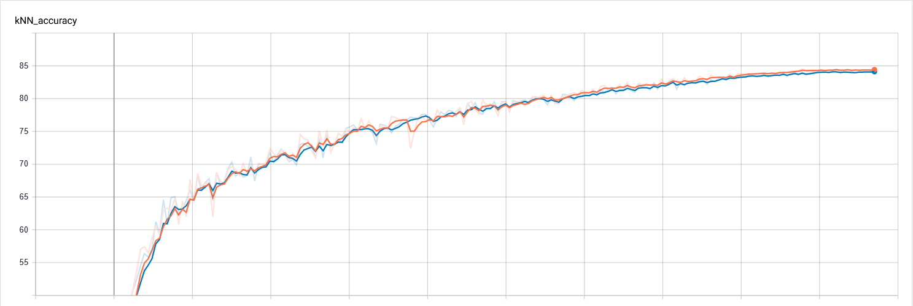
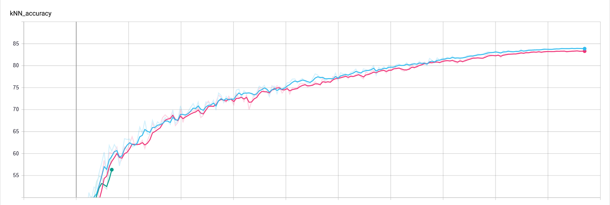

# CO2

PyTorch Implementation of the CO2 paper: [Consistent Contrast for Unsupervised Visual Representation Learning](https://arxiv.org/abs/2010.02217).

An implementation is included in the [lightly PIP package](https://github.com/lightly-ai/lightly). Please refer to the [documentation](https://docs.lightly.ai/lightly.loss.html) for additional information.

## Installation

```
pip install -r requirements.txt
```

## Dependencies
- PyTorch
- PyTorch Lightning
- Torchvision
- lightly

## Benchmarks
We benchmark the CO2 regularizer on the CIFAR-10 dataset following the KNN evaluation protocol.


Model | CO2 | # of negatives | t_consistency | alpha | Epochs | Batch Size | Test Accuracy 
------:|----:|---------:|------:|-------:|------:|-------:|---------------:
MoCo |  | | 1.0 | 1.0 | 200 | 512 | 0.842
MoCo | &#x2611; | 4096  | 1.0 | 1.0 | 200 | 512 | 0.845
SimCLR |  | | 1.0 | 1.0 | 200 |  512 | 0.834
SimCLR | &#x2611;  | 512| 1.0 | 1.0  | 200 | 512 | 0.840

We observe marginal improvements of the regularized models over the default implementations on CIFAR-10. The largest improvement is achieved by SimCLR with an accuracy improvement of 0.6%.

> Although the accuracy improvements are marginal, they are consistent across all experiments we did (the table only shows the best results).

**KNN Accuracy over 200 epochs of training MoCo with and without CO2** (Orange: w/ CO2, Blue: w/o CO2)



**KNN Accuracy over 200 epochs of training SimCLR with and without CO2** (Blue: w/ CO2, Pink: w/o CO2)
